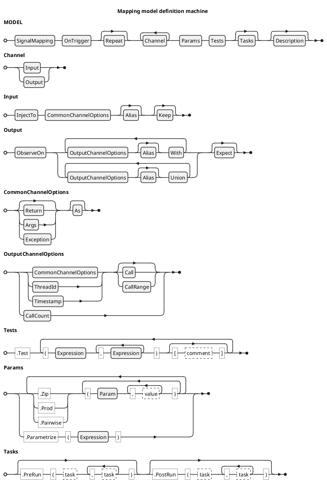

<!-- (c) Copyright 2024 Zenseact AB -->
<!-- SPDX-License-Identifier: Apache-2.0 -->

# Signal Mapping Definition Machine

:construction: *This document is in progress* :construction:

The model definition machine utilizes method cascading with an entry point at
[SignalMapping](/CxxRef/classzmbt_1_1mapping_1_1SignalMapping/) class, which consumes a model name.

Each subsequent method call consumes parameters and transitions to a
subclass of [ModelDefinition](/CxxRef/classzmbt_1_1mapping_1_1ModelDefinition/) that narrows the choices to methods
valid for that specific step, effectively forming a push-down automaton.
This technique simplifies the API usage, enhancing the code completion
and checking certain errors at compilation stage.

Each model is resolved and tested on reaching its destructor.

The railroad diagram below shows the incomplete BNF definition of the
Signal Mapping DSL. Certain terminal rules are not given in BNF but linked to the
corresponding method overload set (see the following description).





!!! warning

    Clauses marked with :construction: below are not implemented and will throw exception.


## Model init clauses

 - [SignalMapping](/CxxRef/classzmbt_1_1mapping_1_1SignalMapping/): test model opening with name parameter
 - [OnTrigger](/CxxRef/structzmbt_1_1mapping_1_1ModelDefinition_1_1T__OnTrigger/): test execution entry point
 - [Repeat](/CxxRef/structzmbt_1_1mapping_1_1ModelDefinition_1_1T__Repeat/): number of trigger calls per test, default 1

## Channel clauses

Each channel node of the model definition starts with `InjectTo` or `ObserveOn` method,
followed with optional parameter clauses. Many clauses assume default value if not specified.

The channel definition node is terminated once the new channel started with the
`InjectTo` or `ObserveOn` method, or when the definition switches to `Parameters`
or `Tests` nodes.


### Interface

These clauses initiate channel definition chain.

 - [InjectTo](/CxxRef/structzmbt_1_1mapping_1_1ModelDefinition_1_1T__InjectTo/): start stimulus definition on a specified interface.
 - [ObserveOn](/CxxRef/structzmbt_1_1mapping_1_1ModelDefinition_1_1T__ObserveOn/): start response observation definition on a specified interface.
 - [With](/CxxRef/structzmbt_1_1mapping_1_1ModelDefinition_1_1T__With/), [Union](/CxxRef/structzmbt_1_1mapping_1_1ModelDefinition_1_1T__Union/): start output combination following `ObserveOn` or same combination clause.

Inputs to these clauses are `(interface[, refobj])` - same syntax as for `InterfaceRecord`
with one exception: default refobj resolves as trigger if compatible mfp provided.

### CommonChannelOptions

 - [Return](/CxxRef/structzmbt_1_1mapping_1_1ModelDefinition_1_1T__Return/): address the interface return value by a signal path (JSON Pointer).
     - default (no args): `"/"`.
 - [Args](/CxxRef/structzmbt_1_1mapping_1_1ModelDefinition_1_1T__Args/): address the interface arguments **tuple** by a signal path (JSON Pointer).
     - default (no args): `"/0"` for unary interfaces, `"/"` otherwise (follows the Boost JSON logic).
 - [Exception](/CxxRef/structzmbt_1_1mapping_1_1ModelDefinition_1_1T__Exception/) (:construction:): address the interface thrown or observed exceptions.
 - [As](/CxxRef/structzmbt_1_1mapping_1_1ModelDefinition_1_1T__As/): set the default overload operator for channel

Inputs to `Args` and `Return` are constant string expressions. Optional overloads support printf-like syntax,
e.g. `Args("/%s/%d", "foo", 42)` is a syntactic sugar for `Args("/%s/%d" | Format("foo", 42))`.

Default channel option (when none of the above are specified):

|         |Input   |Output  |
|---------|--------|--------|
|Trigger  |`Args`  |`Return`|
|Mock     |`Return`|`Args`  |

The default resolution logic follows intuition and conventional function syntax of C-like languages:
- default injection to trigger goes into args
- default injection to mock goes into return
- default observation on trigger is taken on return
- default observation on mock is taken on args

You may need to handle mutable reference argument in mock or trigger - these cases are fully supported:
`InjectTo(mock).Args()` or `Observe(trigger).Args()`.

`As` clause is an equivalent to wrapping the corresponding test conditions with
[`Overload`](/dsl-reference/expressions/#overload) expression. It is used to reduce repetitive `Overload` in `Test` clause table.

### OutputChannelOptions

 - [Timestamp](/CxxRef/structzmbt_1_1mapping_1_1ModelDefinition_1_1T__Timestamp/)
 - [ThreadId](/CxxRef/structzmbt_1_1mapping_1_1ModelDefinition_1_1T__ThreadId/)
 - [Call](/CxxRef/structzmbt_1_1mapping_1_1ModelDefinition_1_1T__CallFilter/): specify the interface call number (0-based).
     - Negative value is resolved as a reverse index, with -1 referring to the last call.
     - default: `-1`
 - [CallRange](/CxxRef/structzmbt_1_1mapping_1_1ModelDefinition_1_1T__CallFilter/): specify the interface call range in 0-based slice with inclusive boundaries.
 - [CallCount](/CxxRef/structzmbt_1_1mapping_1_1ModelDefinition_1_1T__CallCount/): address the number of observed interface calls (used for mocks).

### Alias

 - [Alias](/CxxRef/structzmbt_1_1mapping_1_1ModelDefinition_1_1T__Alias/): specify how the channel is referenced in log and in `Union` output. Default is channel absolute index.

### Fixed conditions

 - [Keep](/CxxRef/structzmbt_1_1mapping_1_1ModelDefinition_1_1T__Keep/): input generator expression, accepting interface call number on evaluation
 - [Expect](/CxxRef/structzmbt_1_1mapping_1_1ModelDefinition_1_1T__Expect/): output matcher expression

If `Keep` or `Expect` specified, the corresponding channel is omitted from `Test` clause.

## Tests

A tabular clause with cascading [operator()](/CxxRef/structzmbt_1_1mapping_1_1ModelDefinition_1_1T__Test/) calls for test vector plus an optional comment in [operator[]](/CxxRef/structzmbt_1_1mapping_1_1ModelDefinition_1_1T__TestComment/).

```c++
.Test
    (1,2,3)
    (4,5,6)     ["I'm a comment"]
    (7,8,9)     ["I'm a %s" | Format("parametrized comment")]
```

Using this syntax instead of conventional containers allows using literals of JSON-convertible types, e.g.:

```c++
.Test
    (MyEnum::Foo, MyEnum::Bar)
    (MyEnum::Lol, MyEnum::Kek)
```

The values in each test vectors are mapped to non-fixed channels (those without `Keep` or `Expect` clauses)
in the order of their definition. For the sake of clarity it is recommended to group fixed channels separately from dynamic ones.

## Params

Clauses [Zip](/CxxRef/structzmbt_1_1mapping_1_1ModelDefinition_1_1T__Zip/), [Prod](/CxxRef/structzmbt_1_1mapping_1_1ModelDefinition_1_1T__Prod/), and [Pairwise](/CxxRef/structzmbt_1_1mapping_1_1ModelDefinition_1_1T__Pairwise/) (:construction:): parameter table in a format similar to `Test`,
enabling non-JSON conditions such as user types or interface pointers.

[Parametrize](/CxxRef/structzmbt_1_1mapping_1_1ModelDefinition_1_1T__Parametrize/) (:construction:): custom parameter table defined with a single Expression

## Tasks

- [PreRun](/CxxRef/structzmbt_1_1mapping_1_1ModelDefinition_1_1T__PreRun), [PostRun](/CxxRef/structzmbt_1_1mapping_1_1ModelDefinition_1_1T__PostRun): list of callbacks invoked before and after test case execution

## Description

 - [Description](/CxxRef/structzmbt_1_1mapping_1_1ModelDefinition_1_1T__Description): optional test description
