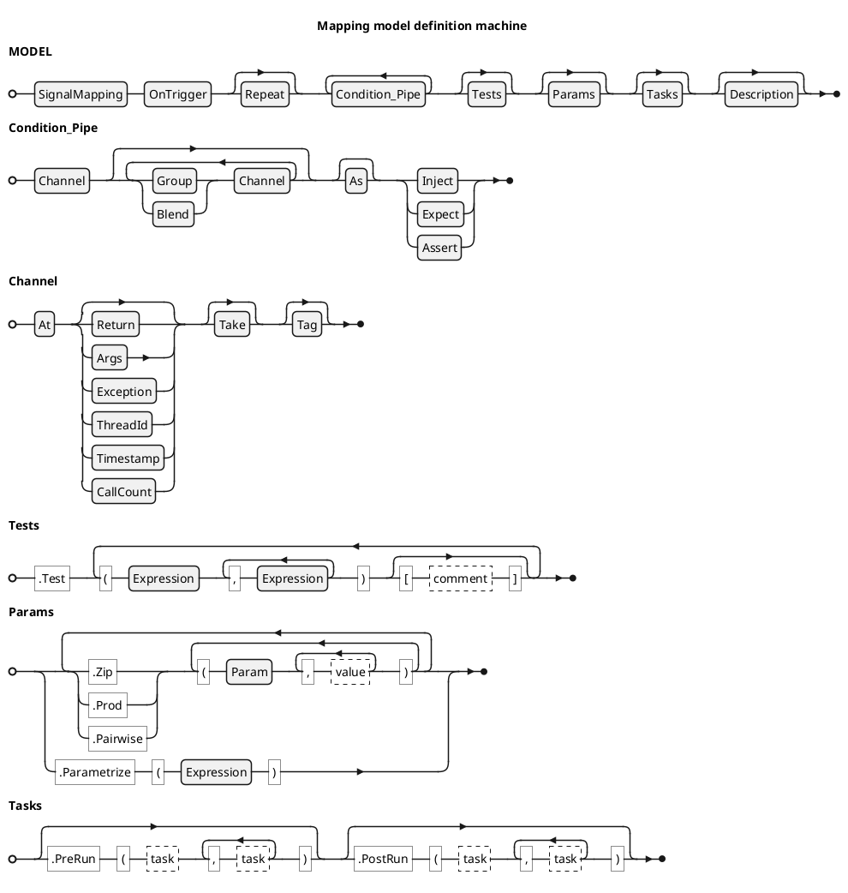

<!-- (c) Copyright 2024 Zenseact AB -->
<!-- SPDX-License-Identifier: Apache-2.0 -->

# Signal Mapping Test Model

:construction: *This document is in progress* :construction:

The model API utilizes method cascading with an entry point at
[SignalMapping](../CxxRef/classzmbt_1_1mapping_1_1SignalMapping/) class, which consumes a model name.

Each subsequent method call consumes parameters and transitions to a
subclass of [ModelDefinition/zmbt-framework/CxxRef/classzmbt_1_1mapping_1_1ModelDefinition/) that narrows the choices to methods
valid for that specific step, effectively forming a push-down automaton.
This technique simplifies the API usage, enhancing the code completion
and checking certain errors at compilation stage.

Each model is resolved and tested on reaching its destructor.

The railroad diagram below shows the incomplete BNF definition of the
Signal Mapping DSL. Certain terminal rules are not given in BNF but linked to the
corresponding method overload set (see the following description).

## Clauses

| Clause                                                 | API reference              | Purpose                                                   |
| ------------------------------------------------------ | -------------------------- | --------------------------------------------------------- |
| `SignalMapping`|[SignalMapping](../CxxRef/classzmbt_1_1mapping_1_1SignalMapping/)| Opens a new test model with a descriptive name. |
| `OnTrigger`                                            |`@T_OnTrigger`              | Declares the function or method that triggers test logic. |
| `Repeat`                                               |`@T_Repeat`                 | Sets the number of trigger invocations per test case.     |
| `At`                                                   |`@T_At`                     | Starts a **signal channel** on a specific interface.      |
| `Args`, `Return`, `Exception`, `Timestamp`, `ThreadId` |`@T_Filter`                 | Select data from the interface call.                      |
| `Take`                                                 |`@T_Take`                   | Applies a transformation expression to the channel value. |
| `Tag`                                                  |`@T_Tag`                    | Annotates the channel for identification/logging.         |
| `Group`, `Blend`                                       |`@T_ContinuePipe`           | Combine channels into a single **pipe**.                  |
| `As`                                                   |`@T_Decor`                  | Applies operator overloading on the pipe.                 |
| `Inject`, `Expect`                                     |`@T_TerminatePipe`          | Define **test conditions** and terminate the pipe.        |
| `Test`                                                 |`@T_Test`                   | Provides test vectors for unspecified inputs/outputs.     |
| `Zip`, `Prod`, `Pairwise`, `Parametrize`               |`@T_Param`, `@T_CustomParam`| Add high-level parameter combinations.                    |
| `PreRun`, `PostRun`                                    |`@T_PreRun`, `@T_PostRun`   | Set optional setup/teardown hooks.                        |
| `Description`                                          |`@T_Description`            | Adds a human-readable test summary.                       |
