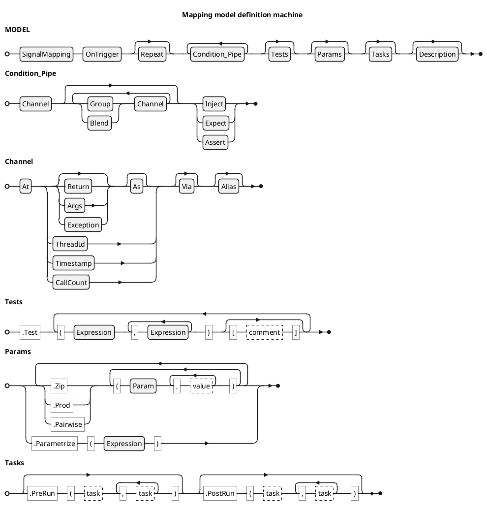

<!-- (c) Copyright 2024 Zenseact AB -->
<!-- SPDX-License-Identifier: Apache-2.0 -->

# Signal Mapping Test Model

:construction: *This document is in progress* :construction:

The model API utilizes method cascading with an entry point at
[SignalMapping](/CxxRef/classzmbt_1_1mapping_1_1SignalMapping/) class, which consumes a model name.

Each subsequent method call consumes parameters and transitions to a
subclass of [ModelDefinition](/CxxRef/classzmbt_1_1mapping_1_1ModelDefinition/) that narrows the choices to methods
valid for that specific step, effectively forming a push-down automaton.
This technique simplifies the API usage, enhancing the code completion
and checking certain errors at compilation stage.

Each model is resolved and tested on reaching its destructor.

The railroad diagram below shows the incomplete BNF definition of the
Signal Mapping DSL. Certain terminal rules are not given in BNF but linked to the
corresponding method overload set (see the following description).





!!! warning

    Clauses marked with :construction: below are work  in progress and will throw *not implemented* exception.


## Model init clause

[SignalMapping](/CxxRef/classzmbt_1_1mapping_1_1SignalMapping/): test model opening with name parameter

## Trigger config

 - [OnTrigger](/CxxRef/structzmbt_1_1mapping_1_1ModelDefinition_1_1T__OnTrigger/): test execution entry point
 - [Repeat](/CxxRef/structzmbt_1_1mapping_1_1ModelDefinition_1_1T__Repeat/): number of trigger calls per test, default 1

## Condition pipes and channels

Condition pipe is a specific input or output *test condition* composed of parameters,
through which the test runner interacts with SUT.

The pipe configuration is a set of interface endpoints, signal filters,
signal transformation rules, identifiers for referencing, and a single injection or matcher expression.

Each pipe is composed from one or more signal channel, which holds configuration for a
single interface.

Channel is defined with [interface clause](#channel-interface), followed by optional parameter clauses.
The complete pipe is terminated with `Inject` clause for inputs or `Expect*|Assert*` clauses for outputs
that holds the corresponding test condition expression. Empty terminal clause means that the corresponding
expression is delegated to [Test Vectors](#test-vectors) table.

Examples:

``` c++
.At(f).Inject(42) // 1-channel input pipe
.At(g).Expect()   // 1-channel output pipe

// 3-channel input pipe
.At(&Producer::get_x).Blend()
.At(&Producer::get_y).Blend()
.At(&Producer::get_z).Inject(MyGenerator)

// 3-channel output pipe with additional filters
.At(&Consumer::set_x)                           .Blend()
.At(&Consumer::set_y).Args(0)                   .Blend()
.At(&Consumer::set_z).Return().As(type<MyType>) .Expect(MyMatcher)
```


### Channel Interface

The following clauses initiate channel definition chain.

 - [At](/CxxRef/structzmbt_1_1mapping_1_1ModelDefinition_1_1T__At/):  begin channel on a given interface and **initiate a pipe**.
 - [And](/CxxRef/structzmbt_1_1mapping_1_1ModelDefinition_1_1T__And/): begin channel on a given interface and **continue pipe**.
 - [Or](/CxxRef/structzmbt_1_1mapping_1_1ModelDefinition_1_1T__Or/): begin channel on a given interface and **continue pipe**.

Arguments to these clauses are `(interface[, refobj])` - same syntax as for `InterfaceRecord`
with one exception: default refobj resolves as trigger if compatible mfp provided.

### Channel Filters

#### Signal Selectors

 - [Return](/CxxRef/structzmbt_1_1mapping_1_1ModelDefinition_1_1T__Return/): address the interface return value by a signal path (JSON Pointer).
     - default (no args): `"/"`.
 - [Args](/CxxRef/structzmbt_1_1mapping_1_1ModelDefinition_1_1T__Args/): address the interface arguments **tuple** by a signal path (JSON Pointer).
     - default (no args): `"/0"` for unary interfaces, `"/"` otherwise (follows the Boost JSON logic).
 - [Exception](/CxxRef/structzmbt_1_1mapping_1_1ModelDefinition_1_1T__Exception/) (:construction:): address the interface thrown or observed exceptions.
 - [As](/CxxRef/structzmbt_1_1mapping_1_1ModelDefinition_1_1T__As/): set the default overload operator for channel

Inputs to `Args` and `Return` are constant string expressions. Optional overloads support printf-like syntax,
e.g. `Args("/%s/%d", "foo", 42)` is a syntactic sugar for `Args("/%s/%d" | Format("foo", 42))`.

Default channel option (when none of the above are specified):

|         |Input   |Output  |
|---------|--------|--------|
|Trigger  |`Args`  |`Return`|
|Mock     |`Return`|`Args`  |

The default resolution logic follows intuition and conventional function syntax of C-like languages:
- default injection to trigger goes into args
- default injection to mock goes into return
- default observation on trigger is taken on return
- default observation on mock is taken on args

You may need to handle mutable reference argument in mock or trigger - these cases are fully supported:
`At(ifc).Args()`.

`As` clause is an equivalent to wrapping the corresponding test conditions with
[`Overload`](/dsl-reference/expressions/#overload) expression. It is used to reduce repetitive `Overload` in `Test` clause table.

#### Interface Properties

 - [Timestamp](/CxxRef/structzmbt_1_1mapping_1_1ModelDefinition_1_1T__Timestamp/)
 - [ThreadId](/CxxRef/structzmbt_1_1mapping_1_1ModelDefinition_1_1T__ThreadId/)
 - [CallCount](/CxxRef/structzmbt_1_1mapping_1_1ModelDefinition_1_1T__CallCount/): address the number of observed interface calls (used for mocks).

#### Alias

 - [Alias](/CxxRef/structzmbt_1_1mapping_1_1ModelDefinition_1_1T__Alias/): specify how the channel is referenced in log and in `Blend` output.
    Default is channel absolute index.

### Test Conditions

Test condition clauses terminate a pipe, configuring it's role as stimulus injection or response observation:

 - [Inject](/CxxRef/structzmbt_1_1mapping_1_1ModelDefinition_1_1T__Inject/)
 - [Expect](/CxxRef/structzmbt_1_1mapping_1_1ModelDefinition_1_1T__Expect/)
 - [ExpectOne](/CxxRef/structzmbt_1_1mapping_1_1ModelDefinition_1_1T__ExpectOne/)
 - [ExpectBatch](/CxxRef/structzmbt_1_1mapping_1_1ModelDefinition_1_1T__ExpectBatch/)
 - :construction:[Assert](/CxxRef/structzmbt_1_1mapping_1_1ModelDefinition_1_1T__Assert/)
 - :construction:[AssertOne](/CxxRef/structzmbt_1_1mapping_1_1ModelDefinition_1_1T__AssertOne/)
 - :construction:[AssertBatch](/CxxRef/structzmbt_1_1mapping_1_1ModelDefinition_1_1T__AssertBatch/)

All of the listed clauses accept [Expression](/dsl-reference/expression) condition, or can be specified without arguments
to indicate that the condition for the corresponding pipe is provided in [Test Vectors](#test-vectors) table.


#### Input generator

`Inject` clause takes an input generator expression of type
$\mathbb{N}^0 \mapsto JSON$

An argument to generator is a call counter managed by test runner.
In :construction: `Group` pipes, each channel has a dedicated counter.
In :construction: `Blend` pipes, all channels share the same counter.

#### Output matcher

Output condition clauses takes matchers of type
$JSON \mapsto bool$. In this context any constant expression `x` interpreted as an `Eq(x)` predicate.

The difference between `Expect*` and `Assert*` clauses is thet the formar reports failed matcher without terminating test execution whle latter applies early stop.

The `*One` and `*Batch` variants are for explicit request of a single value or a batch.

The `*One` clauses assume the observed interface expected to be invoked once from the SUT.
The observed sample is passed directly to the matcher.
Zero or more than one calls considered an error.

The `*Batch` clauses assume the matcher is applied to the whole captured sample batch (possibly empty).

The main `Expect` and `Assert` clauses without suffixes resolves this configuration implicitly using the folowing rules:

 - if [Repeat](#trigger-config) = 1 and number of observed samples = 1: pass observed sample to the matcher directly (same as `*One`)
 - if [Repeat](#trigger-config) != 1 and number of observed samples != 1: pass observed samples batch to the matcher as array (same as `*batch`)


## Test vectors

A tabular clause with cascading [operator()](/CxxRef/structzmbt_1_1mapping_1_1ModelDefinition_1_1T__Test/) calls for test vector plus an optional comment in [operator[]](/CxxRef/structzmbt_1_1mapping_1_1ModelDefinition_1_1T__TestComment/).

```c++
.Test
    (1,2,3)
    (4,5,6)     ["I'm a comment"]
    (7,8,9)     ["I'm a %s" | Format("parametrized comment")]
```

Using this syntax instead of conventional containers allows using literals of JSON-convertible types, e.g.:

```c++
.Test
    (MyEnum::Foo, MyEnum::Bar)
    (MyEnum::Lol, MyEnum::Kek)
```

The values in each test vectors are mapped to non-fixed channels (those without `Inject` or `Expect` clauses)
in the order of their definition. For the sake of clarity it is recommended to group fixed channels separately from dynamic ones.

## Params

Clauses [Zip](/CxxRef/structzmbt_1_1mapping_1_1ModelDefinition_1_1T__Zip/), [Prod](/CxxRef/structzmbt_1_1mapping_1_1ModelDefinition_1_1T__Prod/), and [Pairwise](/CxxRef/structzmbt_1_1mapping_1_1ModelDefinition_1_1T__Pairwise/) (:construction:): parameter table in a format similar to `Test`,
enabling non-JSON conditions such as user types or interface pointers.

[Parametrize](/CxxRef/structzmbt_1_1mapping_1_1ModelDefinition_1_1T__Parametrize/) (:construction:): custom parameter table defined with a single Expression

## Tasks

- [PreRun](/CxxRef/structzmbt_1_1mapping_1_1ModelDefinition_1_1T__PreRun), [PostRun](/CxxRef/structzmbt_1_1mapping_1_1ModelDefinition_1_1T__PostRun): list of callbacks invoked before and after test case execution

## Description

 - [Description](/CxxRef/structzmbt_1_1mapping_1_1ModelDefinition_1_1T__Description): optional test description
