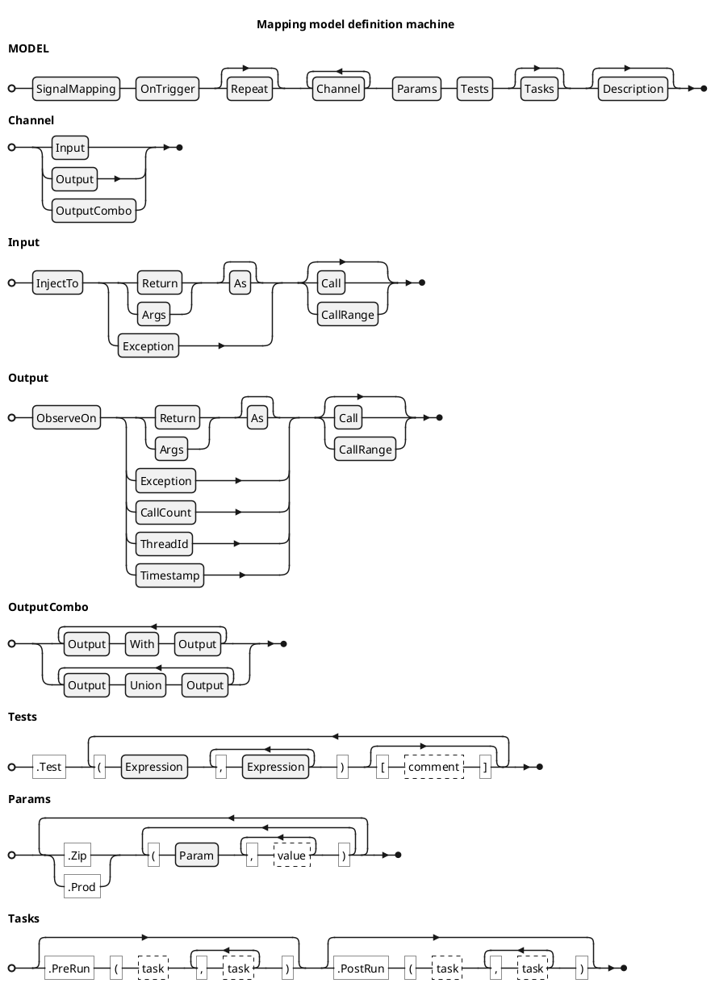

<!-- (c) Copyright 2024 Zenseact AB -->
<!-- SPDX-License-Identifier: Apache-2.0 -->

# Signal Mapping Definition Machine

:construction: *This document is in progress* :construction:

The model definition machine utilizes method cascading with an entry point at
`zmbt::api::SignalMapping` class, which consumes a model name.

Each subsequent method call consumes some parameter and transitions to a
subclass of `zmbt::mapping::ModelDefinition` that narrows the choices to methods
valid for that specific step, effectively forming a push-down automaton.
This technique simplifies the API usage, enhancing the code completion
and checking certain errors at compilation stage.

Each model is resolved and tested on reaching it's destructor.

The railroad diagram below shows the incomplete BNF definition of the
Signal Mapping DSL. Omitted rules may be deduced from
introduction given above or from the following documentation.

<!--  -->

### Channel clauses

Each channel node of the model definition starts with `InjectTo` or `ObserveOn` method,
that defines a signal role, stimulus for `InjectTo` and observed response for `ObserveOn`.

The channel definition node is terminated once the new channel started with the
`InjectTo` or `ObserveOn` method, or when the definition switches to `Parameters`
or `Tests` nodes.

Channel parameters:

- **Role**:
    - `InjectTo`: start stimulus definition on a specified interface.
    - `ObserveOn`: start response observation definition on a specified interface.
    - interface referencing syntax and defaults are the same as for `InterfaceRecord`
      with one exception: refobj resolves as trigger object if compatible mfp provided.
- **Kind**:
    - `Return`: address the interface return value by a signal path (JSON Pointer).
        - default (no args): `"/"`.
    - `Args`: address the interface arguments **tuple** by a signal path (JSON Pointer).
        - default (no args): `"/0"` for unary interfaces, `"/"` otherwise (follows the Boost JSON logic).
    - `CallCount`: address the number of observed interface calls (used for mocks).
    - `Exception`: address the interface thrown or observed exceptions.
    - default kind (when none of the above are specified):
        - if on trigger: `Args` for `InjectTo`, `Return` for `ObserveOn`.
        - if on mock: `Args` for `ObserveOn`, `Return` for `InjectTo`.
- **Other**:
    - `As`: specify the type decorator for channel signal (see zmbt::SignalOperatorHandler).
        - default: `zmbt::GenericSignalOperator`, good enough for most cases.
    - `Call`: specify the interface call number (1-based).
        - Negative value is resolved as a reverse index, with -1 referring to the last call.
        - default: `-1`
    - `CallRange`: specify the interface call range in 1-based slice with inclusive boundaries.

### Interface referencing

WIP
