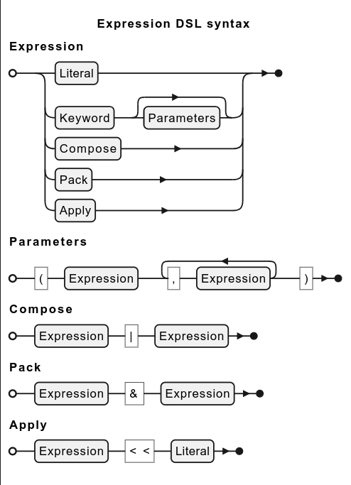

<!-- (c) Copyright 2025 Zenseact AB -->
<!-- SPDX-License-Identifier: Apache-2.0 -->

# Expression DSL {#expression-dsl}

[TOC]

* This section is in progress *

ZMBT utilizes an embedded functional programming language to simplify the test data manipulation and mathicng.

The language resides in zmbt::expr namespace and consist of keywords that can be parametrized and combined in
a single expression, resulting in a functor object of type `JSON -> JSON`, which is evaluated by test model runners.


## Syntax {#expression-dsl-syntax}

There expression keywords compose five groups partitioned by the resulting arity,
counting both design-time and evaluation-time parameters.

The general syntax is either `Keyword` or `Keyword(<Expression list>...)`, where the second form
is a design-time parametrisation, but not yet an evaluation.
Both forms yields a `zmbt::Expression` with [eval](\ref zmbt::Expression::eval) method, used by the framework in run-time.

The `>>` operator is a syntactic sugar for `eval`, and used in the examples below for brevity.

### Keyword forms {#expression-dsl-forms}

|Form    | Function Type                                             |Example                               |
|--------|-----------------------------------------------------------|--------------------------------------|
|Const   |\f$ E^C            \mapsto (x \mapsto C)                \f$|`Pi >> null = 3.1415...              `|
|Unary   |\f$ E^f            \mapsto (x \mapsto f(x))             \f$|`Sin >>` \f$\frac{\pi}{2}\f$ `= 1    `|
|Binary₁ |\f$ E^*            \mapsto ([x, y] \mapsto x * y )      \f$|`Add >> [2,2] = 4                    `|
|Binary₂ |\f$ E^*(y)         \mapsto (x \mapsto x * y      )      \f$|`Eq(42) >> 13 = ⊥                    `|
|Binary₃ |\f$ E^*            \mapsto (x \mapsto x * default)      \f$|`Max >> [-1,1] = 1                   `|
|Ternary |\f$ E^f(a, b)      \mapsto (x \mapsto f(a, b)(x))       \f$|`Recur(Pow(2), 4) >> 4 = 65536       `|
|Variadic|\f$ E^f(a,b,c,...) \mapsto (x \mapsto f(a,b,c,...)(x))  \f$|`All(Gt(5), Le(6)) >> 6 = ⊤          `|
|Literal₁|Evaluated as is where a value is expected                  |`Serialize >> Eq(0) ≢ Serialize >> 0 `|
|Literal₂|Evaluated as `Eq(value)` where a function is expected      |`Filter(42) ≡ Filter(Eq(42))         `|

The **Const** keywords are de-facto unary, as the resulting expression still cat take any argument at eval-time like
true **Unary**, with the difference that constants will ignore the input, which simplifies expression composition.

**Binary** keywords have the most flexible syntax. The canonic **Binary₁** form with no parameters like `Add` expects
a pair at eval-time input, but **Binary₂** form like `Add(42)` essentialy creates an unary functor with bound right-hand side operand.

The predicate keywords in third form are very similar to GoogleTest matchers, e.g. `Eq(42)` or `Lt(0.5)`.
It may be also helpful for understanding to look this form from OOP prespective, considering it as
a class method on eval-time argument object. E.g.,
```js
At(1) >> ["foo", 42]
```
is equivalent to
```js
["foo", 42].At(1)
```
in a generic OOP syntax.


Most of the non-commutative binary operators has a counterpart expression `*From`,
which is evaluated under the same rules but with operands swapped. This API is likely to be changed
before the [MS 2](https://github.com/zenseact/zmbt-framework/milestone/2).
For other cases, the composition with [Reverse](\ref zmbt::expr::Reverse) can be utilized in the **Binary₁** form to get the proper commutation.


The **Binary₃** form replaces the **Binary₁** behavior for a small group of expressions that have the
default rhs value, e.g. `Max(Id)` is equivalent to just `Max`, where the identity expression [Id](\ref zmbt::expr::Id)
is a default parameter (a key function in this case).


the **Ternary** and **Variadic** keywords, with a few exceptions,
follows the same evaluation rule as **Binary1** vs **Binary₂** for cases with no design-time parameters, e.g. variadic
```js
Format("Hello", "world") >> "%s, %s!"
Format >> ["%s, %s!", ["Hello", "world"]]
```
are both valid and produce the same result.

### Composition and high-order keywords

Several keywords produce high-order expressions that are useful for creating a complex matchers or generators.

The most powerful in this group are `Apply`, `Compose`, and `Pack`, which also can be expressed with
overloaded infix operators for brevity (listed in precedence order from highest to lowest):

|Operator|Full form                                    | Description|
|----    |----                                         |----------- |
|<<      |[Apply(lhs, rhs)](\ref zmbt::expr::Apply)    | bind run-time x at design time |
|\|      |[Compose(rhs, lhs)](\ref zmbt::expr::Compose)| compose expessions |
|&       |[Pack(lhs, rhs)](\ref zmbt::expr::Pack)      | evaluate and pack results into an array |

Do not confuse the Apply left shift operator `<<` with right shift `>>` which stands for inline evaluation.

Check other high order keywords at [Expression DSL reference](\ref expression-dsl-reference-high-order)

## Debug evaluation {#expression-dsl-debug}

Complex expressions evaluation

```cpp
Expression::EvalConfig cfg{};
cfg.log = Expression::EvalLog::make();

auto const f = Reduce(Add) & Size | Div;
auto const x = L{1,2,3,42.5};
f.eval(x, cfg);
std::cerr << cfg.log << '\n';
```

Produced output is printed bottom-up in order of evaluation:
```
         ┌── ":add"([1,2]) = 3
         ├── ":add"([3,3]) = 6
         ├── ":add"([6,4.25E1]) = 4.85E1
      ┌── {":reduce":":add"}([1,2,3,4.25E1]) = 4.85E1
      ├── ":size"([1,2,3,4.25E1]) = 4
   ┌── {":pack":[{":reduce":":add"},":size"]}([1,2,3,4.25E1]) = [4.85E1,4]
   ├── ":div"([4.85E1,4]) = 1.2125E1
□  {":compose":[":div",{":pack":[{":reduce":":add"},":size"]}]}([1,2,3,4.25E1]) = 1.2125E1
```
Log lines are formatted as `f(x) = result`, and connected with line-drawing to show the expression terms hierarchy.

In model tests, the evaluation stack is logged on failing tests.
For the bulky log messages the elements are trimmed with `...` while trying to keep evaluation result visible:
``` json
{":compose":[":div",{":pack":[{":reduce":":add"},":size"]}]}([1,2,3,...) = 5
```
For the complete log data refer to JSON log.

## Grammar




<!-- plantuml
@startebnf expression_dsl_syntax
title Expression DSL syntax

!define LB "("
!define RB ")"
!define CM ","

!define REST(x) {CM, x}-
!define ONEORMORE(x) x, REST(x)

Expression = Literal | (Keyword, [Parameters]) | Compose | Pack | Apply;
Parameters = (LB, Expression, RB)
    | (LB, Expression, CM, Expression, RB)
    | (LB, ONEORMORE(Expression), RB);


Compose = Expression, '|', Expression;
Pack = Expression, '&', Expression;
Apply = Expression, '<<', Literal;

@endebnf
-->
