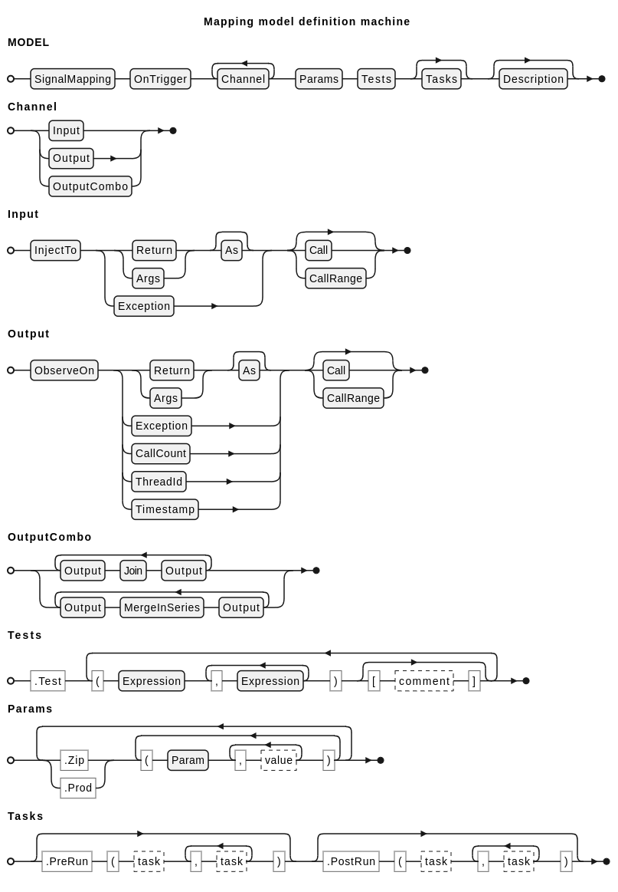

<!-- (c) Copyright 2024 Zenseact AB -->
<!-- SPDX-License-Identifier: Apache-2.0 -->

Signal Mapping model
=================

***Signal Mapping*** model represents the system under test (SUT) as a pure
mathematical mapping, abstracting away side effects and clearly defining the
*role* of each test parameter. This approach contrasts with common
scenario-based methods in unit testing, which often intertwine the declaration
of test goals with test implementation details in a single workflow.


## Overview

Before diving into the test model definition, let's first look into some examples.
All the library funtions below are available in namespace `zmbt::api`.

### Simple function test

``` c++
auto sum = [](int x, int y){ return x + y; };

SignalMapping("Simple function test")
.OnTrigger(sum)
    .InjectTo  (sum) .Args(0)
    .InjectTo  (sum) .Args(1)
    .ObserveOn (sum) .Return()
.Test
    (2,  2, 4)
    (2, -2, 0)
;
```

Here we define a mapping with two inputs and one output.
The `OnTrigger` method specifies an entry point of the test,
the `InjectTo(sum).Args(X)` lines tells the model runner where to put stimuli,
and the `ObserveOn(sum).Return()` tells where to look for
responses.

The `Test` method initiates a list of test vectors (in form of a `operator()`
cascade), where each vector represent a single test case.
Three lines with `InjectTo` and `ObserveOn` create a list of *channels* that
serves as headers for the corresponding columns in the `Test` matrix.

On reaching the models destructor at the last line, the test runner will invoke `sum` for each test vector,
taking the first two values as arguments and checking that result matches
the third value.


### Test with mocks

``` c++
struct Mock {
    bool set_values(int& x, int& y) {
        // ZMBT mock api
        return InterfaceRecord(&Mock::set_values).Hook(x, y);
    }
};

struct Sut {
    Mock mock {};
    int operator()() {
        int x, y;
        bool ok = mock.set_values(x, y);
        return ok ? (x + y) : 0;
    }
} sut {};

SignalMapping("Test with mock")
.OnTrigger(sut)
    .InjectTo  (&Mock::set_values) .Return()
    .InjectTo  (&Mock::set_values) .Args(0)
    .InjectTo  (&Mock::set_values) .Args(1)
    .ObserveOn (sut)               .Return()
.Test
    (true , 2,  2, 4)
    (true , 2, -2, 0)
    (false, 2,  2, 0) // mock returns false, values discarded
;
```

In this example the stimuli are taken from the mock object,
which also informs about operation succes with returned boolean.
So we again inject to `.Args(0)` and `.Args(1)`, but this time on different
interface, plus our test now includes a channel for mock return status.

The mocking is done with `zmbt::api::InterfaceRecord`, that reroute
calls to the `zmbt::api::Environment`, accessed by test runner.
It is a universal API that works the same way for all kinds of callables,
including templates. In this example the mock behaves as a singleton -
all Mock instances delegates to the same record. If you need to differentiate
instances, this can be done by adding reference object to the record:

``` c++
// mock
return zmbt::api::InterfaceRecord(this, &Mock::set_values).Hook(x, y);
// corresponding channel clause
.InjectTo  (mock_obj, &Mock::set_values)
```


### Parametrized test

The examples above show invariant models with parameters specified by literals,
but a model is not a model unless we allow variable parameters.
Let's look at another example:

``` c++
struct Mock {
    void log(std::string msg) {
        return InterfaceRecord(&Mock::log).Hook(msg);
    }
};

struct Sut {
    Mock mock {};

    int foo(int)    { mock.log("Sut::foo"); return 42; };
    int bar(double) { mock.log("Sut::bar"); return 42; };
    int baz()       { mock.log("Sut::baz"); return 42; };
};

auto sut = std::make_shared<Sut>();

Param const Ifc  {"test interface"};
Param const Name {"interface name"};

SignalMapping("Test with zip params")
.OnTrigger(sut, Ifc)
    .InjectTo  (sut, Ifc)
    .ObserveOn (sut, Ifc)
    .ObserveOn (&Mock::log)
.Test
    (Noop, 42, Name)
    (Noop, 42, Name)
    (Noop, 42, Name)
.Zip
    (Ifc , &Sut::foo , &Sut::bar , &Sut::baz )
    (Name, "Sut::foo", "Sut::bar", "Sut::baz")
;
```

In this example, the `Zip` method introduces model parametrization.
Like `Test`, it initiates a list of parameters in an `operator()`
cascade. Each row in this table begins with a parameter key (created with
`Param`), followed by corresponding values.

Before the model runner comes into play, the model resolver
transforms such a definition into a series of invariant instances,
resulting in nine test cases (3 instances times 3 test vectors).

Other features introduced in this example are:

 - Default channel kind deduction - we can omit `Args(0)` and `Return()`
specifiers, as they are deduced by model resolver from the interface by the
following rule:
   - *on trigger*: inject to args and observe on return,
   - *on mock*: inject to return and observe on args,
   - *unary function args* resolves to value, the rest
     resolve to the arguments tuple (more on this later).
- `Noop` expression - a special keyword allowing to stub
  uninteresting channels. In this case, we don't care about function inputs
  (consider it is tested elsewhere), so `Noop` tells the model runner to
  inject default stimuli or ignore the responses.

The `Zip` clause requires all parameter lists to be of equal length or
containing a single element which intended to be repeated with other parameters:

``` c++
.Zip
    (X, 1, 2, 3)
    (Y, 1, 2, 3)
    (Z, 4)
```
This clause yields *(1,1,4), (2,2,4), (3,3,4)*, but the following one will fail
in runtime due to inconsistent zip parameters count:
``` c++
.Zip
    (X, 1, 2, 3)
    (Y, 1, 2)
    (Z, 4)
```


You can also repeat the same parameter key in multiple rows to avoid super-wide tables
like this:

``` c++
.Zip
    (X, 1, 2, 3)
    (Y, 1, 2, 3)

    (X, 4, 5, 6)
    (Y, 4, 5, 6)
```

which is equivalent to

``` c++
.Zip
    (X, 1, 2, 3, 4, 5, 6)
    (Y, 1, 2, 3, 4, 5, 6)
```

The order of parameter keys doesn't matter, and you may notice that parameters
table oriented hosrisontally, i. e. *row -> parameter*, unlike the test matrix,
which is *column -> channel*.

Another parametrization mode is `Prod`, which stands for *Cartesian product*,
so the clause
``` c++
.Prod
    (X,  1,  2)
    (Y, 10, 20)
```
yields a set of 4 model instances with *X, Y* equals
*(1, 10), (1, 20), (2, 10), (20, 20)* correspondingly.


Parameter clauses can be used multiple times - each clause creates an independent group.
`Prod` and `Zip` clauses also can be chained

``` c++
.Prod
    (X, 1)
    (Y, 10, 20)
.Prod
    (X, 2)
    (Y, 30, 40)
.Zip
    (X, 3)
    (Y, 50, 60)
```

Here each clause initiates a separate product or zip set, resulting in
*(1, 10), (1, 20), (2, 30), (2, 40), (3, 50), (3, 60)*


### Subsignal reference

Signal serialization allows specifying the particular subsignal with string
(we call it signal path), e. g.

``` c++
.InjectTo (sut).Args("/0/foo/bar")
.InjectTo (sut).Args("/1/foo/bar")
.ObserveOn(sut).Return("/foo/bar")
```

which refers to `<signal>.foo.bar` field on the corresponding argument or
return value. The subsignal specification in a string is a [JSON Pointer](https://tools.ietf.org/html/rfc6901),
which syntax resembles a unix path, with the main difference that `""` stands
for root, and `"/"` stands for anonimous field in a JSON structure. Array elements are
referenced by index, so `"/0"` and `"/1"` in the example means first and second
elements of the arguments tuple. Recall the rule of default channel kind
deduction - now you see that *unary function args resolves to value...* means
the default signal path for unary function is `"/0"`.

This works with parametrization well - if you need to parametrize only a part
of signal path, use a printf-like syntax as follows:

``` c++
.InjectTo (sut).Args("/%d/%s/bar", Index, Field)
```

Considering the *Index* and *Field* are parameter keys, the signal path here is
a deferred format object that is transformed to an actual string by the model
resolver when the parameter values are known.


### Non-scalar values

Signal serialization with JSON allows specifying non-scalar test values.
We can merge `Args(0)`, `Args(1)` from the first example
into a single channel that refers to arguments tuple, and the corresponding
test value may be represented with literal Boost JSON array:

``` c++
auto sum = [](int x, int y){ return x + y; };

SignalMapping("Simple test with non-scalar channel")
.OnTrigger(sum)
    .InjectTo  (sum)
    .ObserveOn (sum)
.Test
    ({2,  2}, 4)
    ({2, -2}, 0)
;
```

However, we recommend breaking your channels into scalars whenever possible
for clarity.

### Expressions {#expressions}

For now we only considered strict equality checks.
The library provides embedded functional scripting language in the `zmbt::expr` namespace,
that enables flexible matchers and more complex test data manipulation:

``` c++
.Test
    (2,  2, 4                ) ["this is a comment"]
    (2,  2, Eq(4)            ) ["same case as above"]
    (2,  2, Ne(5)            ) ["not equals 5"]
    (2,  2, Not(Eq(5))       ) ["same as above"]
    (2,  2, Gt(1)            ) ["greater than 1"]
    (2,  2, And(Ge(0), Le(5))) ["between 0 and 5"]
    (2,  2, In({1,2,3,4})    ) ["is element of {1,2,3,4} set"]
    (2,  2, Near(3, .5)      ) ["approximation with relative tolerance"]
    (2,  2, Not(Nil())       ) ["bool(signal) resolves to true"]
```

The predicate functions can be combined with `And`, `Or`, `Not`, and `Xor`.

When the observed signal is set-like, we can apply set-specific expressions:

``` c++
auto sut = [](std::vector<int> x){ return x; };

SignalMapping("Test set expressions")
.OnTrigger(sut)
    .InjectTo  (sut)
    .ObserveOn (sut)
.Test
    ( {1,2,3}   , Eq({1,2,3})                   )
    ( {1,1,1}   , Size(3)                       )
    ( {1,1,1}   , Card(1)                       )
    ( {1,2,3}   , SetEq({1,1,2,2,3,3})          )
    ( {1,2,3}   , Subset({1,2,3})               )
    ( {1,2,3}   , Superset({1,2,3})             )
    ( {1,2,3}   , ProperSubset({1,2,3,4})       )
    ( {1,2,3}   , ProperSuperset({1,3})         )
    ( {1,2,3}   , Not(ProperSubset({1,2,3}))    )
    ( {1,2,3}   , Not(ProperSuperset({1,2,3}))  )
    ( {1,2,3}   , Ni(1)                         )
    ( {1,2,3}   , Not(Ni(42))                   )
    ( {1,2,3}   , Saturate(Ne(5), 2, 3)         )
    ( {1,2,3}   , Count(Ne(5), 3)               )
    ( {1,2,3}   , Count(2, Lt(3))               )
    ( {1,2,3}   , And(At(0, 1), At("/1", 2))    )
    ( {1,2,3}   , Re("^\\[1,2,3\\]$")           )
;
```

- `Size`: size of array or object
- `Card`: set cardinality (number of unique elements). For objects size and cardinality are equal.
- `SetEq`: set equality (ignore duplicates and order)
- `Subset, Superset, ProperSubset, ProperSuperset`: common set tests
- `Saturate(expr, expr...)`: saturate matches against array in strict order
- `Count(expr, n)`: count expr matches in array and check agains n expr (can be an arbitrary expr)
- `At(jp, expr)`: test match at JSON pointer or array index


Most of binary expressions are functors with optional parametrization in form
 1. `Expr = x => x1 @ x2`
 2. `Expr(y) = x => x @ y`

Example:
``` c++
assert(Lt(42).match(41));
assert(Lt.match({41, 42}));
```

This semantic works both for all terminal binary expressions expressions, including set matchers
and arithmetic transforms (`Subset`, `Contains`, `Add`, etc.).


High-order expressions can be used to manipulate both test inputs and outputs (WIP):
``` c++
assert(Reduce(Add, 0).eval({1,2,3,4}) == 10);
assert(Map(Pow(0.5)).eval({4,9,16,25}) == boost::json::array{2,3,4,5});
```


### Signal type decoration

The predicate expressions described above knows nothing about actual
operations - to apply them to a particular value, they need an operator handler.

The default `GenericSignalOperator` does most of comparisons in an intuitive
way, allowing order checks on strings and array-like structures.

Sometimes you need to apply specific C++ comparison operators - for such case
a channel can take another parameter:

``` c++
.InjectTo(sum).As(type<int>)
```

The operator handler constructed from `type<int>` will provide to the model
the following functions:

 - equality check (`operator==`)
 - order check (`operator<`)
 - logical check (`operator bool`)
 - transform function (in form of `json_from ∘ json_to<int>`) - to ensure correct
   type representation.

If specific type does not support certain operators, they will be substituted
with stubs that will throw exception if invalid assertions applied in test.

This mechanism allows utilizing type decorators in place of actual signal types:

``` c++
auto DoubleToFloat = [](double x) -> float { return x; };

SignalMapping("Narrowing conversion (double) -> float")
.OnTrigger(DoubleToFloat)
    .InjectTo  (DoubleToFloat) .As(type<precise<double>>)
    .ObserveOn (DoubleToFloat) .As(type<precise<float>> )

.Test
    (0.125                 , 0.125           ) ["ok: power of 2"]
    (.2                    , .2f             ) ["ok: correct repr of float"]
    (.2                    , .2              ) ["fail from precise<float> ctor"]
    ("0x1.199999999999ap+0", "0x1.19999ap+0" ) ["ok with float literals"]
;
```

In this example we utilize a signal decorator template `zmbt::api::precise`,
that checks the correct value representation for third case
(as `.2` can't be represented in float), and allows conversion to/from floating
point hexadecimal literals in string in forth case.

### Handle specific mock call

`Call` parameter sets the interface call number,
supporting negative values for reverse indexation. It is applicable both to
stimuli and responses, and can be combined with `Args` or `Return`.
Default value is -1, which means that the corresponding
stimulus is repeated on each call, but the match expression is only applied to
the last observation (range specification for `Call` is work in progress).


``` c++
struct Mock {
    int get_value() {
        return InterfaceRecord(&Mock::get_value).Hook();
    }
};

auto sut = []() {
    Mock mock{};
    int x = mock.get_value();
    int y = mock.get_value();
    return x + y;
};

SignalMapping("Test Call")
.OnTrigger(sut)
    .InjectTo (&Mock::get_value).Call(1)
    .InjectTo (&Mock::get_value).Call(2)
    .ObserveOn(sut)
.Test
    (2,  2, 4)
    (2, -2, 0)
;
```


### Handle multiple calls

In situations when `Call` is insufficient or too verbose, e.g. when the
number of calls is dynamic, `CallRange` specifier can be used to access
multiple mock calls at once. If a signal path is specified on
`Args` or `Return` node, it is used to transform the resulting list to
cherry-pick only interesting subsignals:

``` c++
struct Mock {
    Bar do_smth(int x, int y) {
        return InterfaceRecord(&Mock::do_smth).Hook(x, y);
    }
};

auto sut = [](int count) {
    Mock mock{};
    int sum = 0;
    while (--count, count >=0) sum += mock.do_smth(count, 42).x;
    return sum;
};

SignalMapping("Test CallRange with arg index")
.OnTrigger(sut)
    .InjectTo  (sut)
    .ObserveOn (&Mock::do_smth).Args(0).CallRange() // all arguments at 0 (x)
    .ObserveOn (&Mock::do_smth).Args(1).CallRange() // all arguments at 1 (y)
.Test
    ( 3, {2,1,0}    , Ni(42)      )
    ( 5, {4,3,2,1,0}, Size(Ge(3)) )
;
```

`CallRange` supports python-like slice semantic, s.t. `CallRange(-1, 0, -1)`
will provide reversed list of call data. Both `CallRange` and `Call` use
1-based indexation. The difference on observation channels is that `CallRange`
will return all captures that falls in the scpecified span or an empty array,
while `Call` will throw an exception if index is outside span.

On injection channels `CallRange` does not accept slice parameters, however,
it allows specifying values in a map instead of simple array:

``` c++
SignalMapping("Test CallRange inject")
    .OnTrigger(sut)
        .InjectTo  (sut)
        .InjectTo (&Mock::do_smth).Return("/x").CallRange()
        .ObserveOn (sut)
    .Test
        ( 5, { 3, 2, 1   }        ,  6 )
        ( 5, {{"-1", 5}, {"2", 4}}, 24 )
    ;
```
In this example we specify number of mock calls, mock return values at Bar::x
field, and expected result of summation. In the first case we pass an array with
3 values - once they consumed and no default value provided to model
(e.g., on a separate channel with `Call` clause), the `do_smth` will return
prototype value (0 in this case). In the second case we set default value in a
map plus a specific value for call #2.

Set-like match expressions may be helpful for testing captures,
see examples [below](#expressions).

`CallCount` channel specifier allows to test how many times the corresponding
mock interface was invoked from the SUT, replacing combination of `CallRange()`
with `Size` expression:

``` c++
SignalMapping("Test CallCount")
.OnTrigger(sut)
    .InjectTo  (sut)
    .ObserveOn (&Mock::do_smth).CallCount()
.Test
    ( 0, Nil())
    (42, 42   )
;
```

### Combining channels

When testing relation between different channels it may be necessary to put their outputs into a single structure.

It can be made with combining clauses like `Join()` or `MergeInSeries()` that will group the outputs according to certain rules.

In the example below, the channel combination below gives a pair of captured args that can be tested with
`Ge` or `Lt` expressions:
``` c++
.ObserveOn (&Mock::foo)
    .Join()
.ObserveOn (&Mock::bar)
```

`MergeInSeries()` combination clause allows to test the order of mock captures,
merging samples in time series.
Combined channels produce a list of pairs `[channel alias, requested signal]`,
sorted by timestamp. Use it in combination with `Saturate` expr for testing strict or partial
order on mock calls.

### Exception testing

This feature is under construction, the API may look as following:

```c++
.InjectTo(mock).Exception(type<std::runtime_error>) // tell mock to throw
.ObserveOn(sut).Exception(type<std::runtime_error>) // catch on trigger
.Test
    ("error message", "regex match")
```

### User data serialization

The library relies on [Boost JSON](https://www.boost.org/doc/libs/1_84_0/libs/json/doc/html/index.html) to handle signals and test data.
Let's create some types for our next example:

``` c++
namespace {
enum class Foo { A, B, C };
struct Bar {
    Foo foo;
    int x;

    Bar() = delete;
    Bar(Foo br, int x) : foo{br}, x{x} {}
};
}
```

The following lines, placed in the same namespace, enables serialization of
`Foo` and `Bar`:

``` c++
BOOST_DESCRIBE_ENUM(Foo, A, B, C)
BOOST_DESCRIBE_STRUCT(Bar, (), (foo, x))
ZMBT_INJECT_JSON_TAG_INVOKE
```

Because `Bar` has deleted default constructor, we need to give ZMBT a hint
on how to initialize a prototype value (should be in a global namespace):

``` c++
ZMBT_DEFINE_CUSTOM_INIT(Bar, (Foo::A, 0))
```

Now we can define test like this:

``` c++
auto sut = [](Bar a, Bar b) {
    Foo foo = a.x > b.x ? a.foo : b.foo;
    int x = a.x + b.x;
    return Bar {foo, x};
};

SignalMapping("User data serialization")
.OnTrigger(sut)
    .InjectTo (sut).Args("/0/x")
    .InjectTo (sut).Args("/1/x")
    .InjectTo (sut).Args("/0/foo")
    .InjectTo (sut).Args("/1/foo")
    .ObserveOn(sut).Return("/foo")
.Test
    (1, 0, Foo::A, Foo::B, Foo::A)
    (0, 1, Foo::A, Foo::B, Foo::B)
;
```

Any types with defined JSON serialization comes for free, including
STL-like containers. ZMBT also provides its own signal serialization,
isolated from Boost JSON, which helps to avoid ADL pollution of the SUT.
Read more on this at [Reflection guide](reflection.md).


### Fixture tasks

The signal mapping models are tested in a presumably clean environment, which
mean that you can't affect the model execution from outside by injecting some
values to the mocks - the test runner will clean the environment test data
before each test case. In many cases we may need some preparation or cleanup
to be done outside the test, a typical task for the test fixture.
This can be done with `PreRun` and `PostRun` methods, that takes a list of tasks:


``` c++
struct Mock {
    int get_value() {
        return InterfaceRecord(&Mock::get_value).Hook();
    }
};

auto sut = []() { return Mock().get_value(); };

SignalMapping("Test pre- and post-run tasks")
.OnTrigger(sut)
    .InjectTo (&Mock::get_value)
    .ObserveOn(sut)
.Test
    (13    , 13)
    (Noop, 42)
.PreRun([]{
    InterfaceRecord(&Mock::get_value).InjectReturn(42);
})
.PostRun([]{
    BOOST_CHECK_EQUAL(InterfaceRecord(&Mock::get_value).ObservedCalls(), 1);
})
;
```

The pre-run task will reset the stimulus to 42 before each test.
On the first test case, this stimulus is overwritten by the value from the
test vector, but in the second case, `Noop` tells the runner to skip injection.

For non-scalar stimuli configured on pre-run stage, any injection will only
update the nodes specified with JSON Pointer, keeping other state unchanged.

### Test Procedure

Now that we know about the model definition, it's time to understand what happens
at test execution stage. The following procedure is applied to each model instance
obtained from the parameter resolver times each test vector:

1. Reset the environment.
2. Execute pre-run tasks.
3. Inject the stimuli from the test vector into the environment.
4. Execute the trigger.
5. Observe the responses captured in the environment and verify against expectations.
6. Execute post-run tasks.
7. Report the results.


### Registering non-signal components

Any non-serializable model component may be registered in the environment and
referenced by a string key. This is what actually happens under the hood when we
placed mfp literals in zip parameters in one of the examples above:

``` c++
.Zip
    (Ifc , &Sut::foo , &Sut::bar , &Sut::baz )
    (Name, "Sut::foo", "Sut::bar", "Sut::baz")
```

We can do that registration explicitly:

``` c++
Environment env{};
env.RegisterTrigger(sut, &Sut::foo, "Sut::foo");
env.RegisterTrigger(sut, &Sut::bar, "Sut::bar");
env.RegisterTrigger(sut, &Sut::baz, "Sut::baz");
env.RegisterInterface(&Mock::log, "Mock::log");

Param const Ifc  {"test interface"};
Param const Name {"interface name"};

SignalMapping("Test with zip params")
.OnTrigger(Ifc)
    .InjectTo  (Ifc)
    .ObserveOn (Ifc)
    .ObserveOn ("Mock::log")
.Test
    (Noop, 43, Ifc)
    (Noop, 42, Ifc)
    (Noop, 42, Ifc)
.Zip
    (Ifc, "Sut::foo", "Sut::bar", "Sut::baz")
;
```

In the same way tasks and operators may be registered and referenced by key.

Benefits from this approach are:
 - meaningful interface names in test report (method cascading doesn't work well with preprocessor)
 - enabled deferred string formatting for interfaces.
 - reuse string parameters in different roles (like `Ifc` in the example)

However, the main objective of making this feature a part of API is under
construction - we plan to allow a complete tests definition in JSON or YAML
format
<!--  -->


<!-- TODO: registering parameters and referencing by string key -->

## Model Definition Machine

The model definition machine utilizes method cascading with an entry point at
`zmbt::api::SignalMapping` class, which consumes a model name.

Each subsequent method call consumes some parameter and transitions to a
subclass of `zmbt::mapping::DefinitionMachine` that narrows the choices to methods
valid for that specific step, effectively forming a push-down automaton.
This technique simplifies the API usage, enhancing the code completion
and checking certain errors at compilation stage.

Each model is resolved and tested on reaching it's destructor.

The railroad diagram below shows the incomplete BNF definition of the
Signal Mapping DSL. Omitted rules may be deduced from
introduction given above or from the following documentation.


<!-- ``` plantuml
@startebnf mapping_syntax
title Mapping model definition machine

!define LB "("
!define RB ")"
!define CM ","

!define REST(x) {CM, x}-
!define ONEORMORE(x) x, REST(x)

MODEL = SignalMapping, OnTrigger, {Channel}-, Params, Tests, [Tasks], [Description];

Channel = Input | Output | OutputCombo;

Input = InjectTo, (
(((Return | Args), [As]) | Exception), [(Call | CallRange)]
);

Output = ObserveOn, (
(((Return | Args), [As]) | Exception | CallCount | ThreadId | Timestamp), [(Call | CallRange)]);

OutputCombo = {Output, (Join, Output)}- | {Output, (MergeInSeries, Output)}-;

Tests = ".Test", {LB, ONEORMORE(Expression), RB, ["[", ?comment?, "]" ]}-;

Params = {(".Zip"| ".Prod"), {LB, Param, REST(?value?), RB}-}-;

Tasks =  [".PreRun", LB, ONEORMORE(?task?), RB], [".PostRun", LB, ONEORMORE(?task?), RB];

@endebnf
``` -->

### More on Channels

Each channel node of the model definition starts with `InjectTo` or `ObserveOn` method,
that defines a signal role, stimulus for `InjectTo` and observed response for `ObserveOn`.

The channel definition node is terminated once the new channel started with the
`InjectTo` or `ObserveOn` method, or when the definition switches to `Parameters`
or `Tests` nodes.

Channel parameters:

- **Role**:
  - `InjectTo`: start stimulus definition on a specified interface.
  - `ObserveOn`: start response observation definition on a specified interface.
  - interface signatures and defaults are the same as for zmbt::api::InterfaceRecord
    with one exception: refobj resolves as trigger object if compatible mfp provided.
- **Kind**:
  - `Return`: address the interface return value by a signal path (JSON Pointer).
    - default (no args): `"/"`.
  - `Args`: address the interface arguments **tuple** by a signal path (JSON Pointer).
    - default (no args): `"/0"` for unary interfaces, `"/"` otherwise (follows the Boost JSON logic).
  - `CallCount`: address the number of observed interface calls (used for mocks).
  - `Exception`: address the interface thrown or observed exceptions.
  - default kind (when none of the above are specified):
    - if on trigger: `Args` for `InjectTo`, `Return` for `ObserveOn`.
    - if on mock: `Args` for `ObserveOn`, `Return` for `InjectTo`.
- **Other**:
  - `As`: specify the type decorator for channel signal (see zmbt::SignalOperatorHandler).
    - default: `zmbt::GenericSignalOperator`, good enough for most cases.
  - `Call`: specify the interface call number (1-based).
    - Negative value is resolved as a reverse index, with -1 referring to the last call.
    - default: `-1`
  - `CallRange`: specify the interface call range in 1-based slice with inclusive boundaries.

### Interface specification

WIP

### Glossary


- **Channel**: Specification for addressing the test stimuli or responses. Channel parameters include *role* (stimulus or response), *interface* (callable reference), *kind* (arguments, return value, exception, or call count), *signal path*, *call* (number of invocation).
- **Environment**: A globally available registry containing all test stimuli and observed responses.
- **Interface**: Function, member function with host object, or callable object, referenced directly (with C++ pointers or refs) or by string key (if registered in the *Environment*).
- **Model**: SUT abstraction focusing on verification of particular feature.
- **Mock**: Test double for callable that reroute any interactions to the *Environment*.
- **Response**: observable signal on SUT
- **Stimulus**: signal affecting the SUT
- **SUT**: System under test
- **Trigger**: A safe SUT execution wrapper for callable that feeds stimuli and captures responses in serialized form, enabling rerouting to the *Environment*.
- **Test Vector**: A list of test values - stimuli signals and expectation matchers for a single test case.
- **Tasks**: Test setup and cleanup callbacks.
