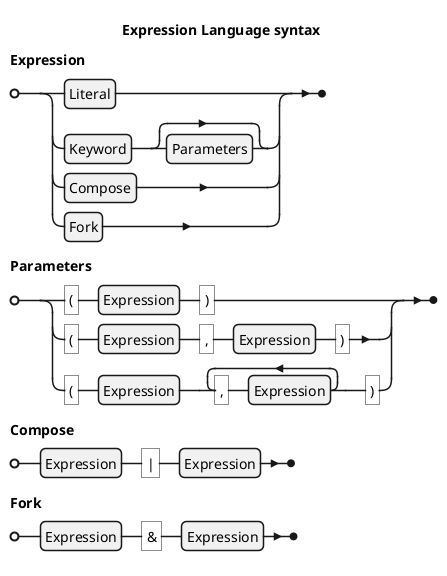

<!-- (c) Copyright 2025 Zenseact AB -->
<!-- SPDX-License-Identifier: Apache-2.0 -->

# ZMBT Expressions

:construction: *This document is in progress* :construction:

ZMBT utilizes an embedded functional programming language for the test data manipulation and matching,
referred to in the documentation simply as *expressions*.

The language resides in the `zmbt::expr` namespace and consists of keywords that can be parametrized and combined into a single expression, resulting in a pure `JSON -> JSON` function, which is evaluated by test model runners. The language belongs to a family of [tacit programming languages](https://en.wikipedia.org/wiki/Tacit_programming).
As it operates on JSON, certain elements may resemble the [jq language](https://jqlang.org/), however, *expressions* focus more on a simpler syntax
and certain test-specific features such as typed operator handling.

The main purpose of using an embedded language over common C++ functions is to give the model runners a full control
over test inputs, notably:

- serialization: any complex transformations are represented in JSON
- introspection: model runner can [explain in detail each step of evaluation](#debug) without any additional effort from user
- reflection: model runner can change terms of expressions to enable high-level parametrization

!!! note

    The $\mapsto$ (maps to) symbol is used below both in mathematical meaning and to express evaluation result in code snippets.

## Syntax

General syntax: `Keyword` or `Keyword(<Expression list>...)`, where the second form is a design-time parametrization, but not yet an evaluation.
Both forms yield a `Expression` object with an `eval` method, used by the framework at runtime.
E.g., `Add` (first form) is an addition function that accepts a pair of operands on evaluation input, and `Add(2)` (second form)
is a function with bound right-hand-side operand.


### Composition

The pipe operator `|` represents a function composition in a human-readable left-to-right order. It is syntactic sugar for the `Compose` expression,
s.t. `A | B | C` is equivalent to `Compose(C, B, A)`, evaluating operands as `C(B(A(x)))`.

Each expression has the same `JSON -> JSON` evaluation type, which is also applicable to both builtin and user-defined constants like `Pi` or JSON literals.
E.g., `42` renders a function $x \mapsto 42$. Such function simply discards any evaluation input, unlike conventional constant functions in C++ that has no arguments.

*Everything is a function* principle allows to compose different kinds of expressions using uniform syntactic rules.
Using a constant or a literal as initial term renders the entire chain a constant expression.

### Fork

Another special operator is ampersand `&`, used to fork the evaluation flow, packing results from operand expressions into an array:
`42 | Add(1) & Sub(1)` $\mapsto$ `[43, 41]`. It is also a syntactic sugar to `Fork` expression.

### Arity forms

Expression keywords are grouped by their design-time plus eval-time parameters arity.

|Form    | Resulting Expression Type                                  |ExampleExpression                               |
|--------|------------------------------------------------------------|------------------------------------------------|
|Const   |$E^C            \mapsto (x \mapsto C)$                      |`Pi`                         $\mapsto 3.1415...$|
|Unary   |$E^f            \mapsto (x \mapsto f(x))$                   |`Div`: `Pi | Div(2) | Sin`      $\mapsto 1$     |
|Binary₁ |$E^*            \mapsto ([x, y] \mapsto x * y )$            |`Add`: `[2,2] | Add`            $\mapsto 4$     |
|Binary₂ |$E^*(y)         \mapsto (x \mapsto x * y      )$            |`Eq`: `13 | Eq(42)`             $\mapsto false$ |
|Binary₃ |$E^*            \mapsto (x \mapsto x * default)$            |`Max`: `[-1,1] | Max`           $\mapsto 1$     |
|Ternary |$E^f(a, b)      \mapsto (x \mapsto f(a, b)(x))$             |`Recur`: `4 | Recur(Pow(2), 4)` $\mapsto 65536$ |
|Variadic|$E^f(a,b,c,...) \mapsto (x \mapsto f(a,b,c,...)(x))$        |`All`: `6 | All(Gt(5), Le(6))`  $\mapsto true$  |
|Literal₁|Evaluated as Const where a value is expected                |`Map(Eq(0))` $\not\equiv$ `Map(0)`              |
|Literal₂|Evaluated as `Eq(value)` where a predicate is expected |`Filter(42)`     $\equiv$ `Filter(Eq(42))`      |

The **Const** keywords create constant functions. They are syntactically equivalent to **Unary**,
with the difference that constants will ignore the eval input value.

Custom constants can be created with `C` or `Let` keyworda, e.g. `C(42)`.
JSON or JSON-convertible literals also create constants, except in a predicate context - then it yields an equality check `Eq(x)`.

**Binary** keywords have the most flexible syntax. The canonical **Binary₁** form with no parameters like `Add` expects
a pair of operands at eval input, but **Binary₂** form like `Add(42)` essentially creates a curried unary
functor with bound ***right-hand side*** operand. To curry a left-hand side operand instead, the `Flip` keyword may be helpful.
This is especially useful for non-commutative operators, e.g.:

* `2 | Div(1)` $\mapsto 2$
* `2 | Flip(Div(1))` $\mapsto 0.5$

For the **Binary₁** the composition with `Reverse` can be utilized instead of `Flip` to get the proper commutation,
as `Flip` only swaps the design-time and eval-time arguments, which differs from Haskell's `flip`.

The predicates in **Binary₂** form are very similar to GoogleTest matchers, e.g. `Eq(42)` or `Lt(0.5)`.
It may also be helpful to view this form from an OOP perspective, considering it as
a class method on eval-time argument object. E.g.,

```js
["foo", 42] | At(1)
```
is equivalent to
```js
["foo", 42].At(1)
```
in a generic OOP syntax.


The **Binary₃** form replaces the **Binary₁** behavior for a small group of expressions that have the
default rhs value, e.g. `Max(Id)` is equivalent to just `Max`, where the identity expression `Id`
is a default parameter (a key function in this case).


The **Ternary** and **Variadic** keywords, with a few exceptions,
follow the same evaluation rule as **Binary1** vs **Binary₂** for cases with no design-time parameters, e.g. variadic `Format`:

* `"%s, %s!"|Format("Hello", "world")` $\mapsto$ `"Hello, world!"`
* `["%s, %s!", ["Hello", "world"]] | Format` $\mapsto$ `"Hello, world!"`


## Parameter evaluation

Design time parameters are constant expressions too, e.g.,
`Lt(42)` is a syntactic sugar for `Lt(C(42))`. A simple use case
is to utilize math constants like `Lt(Pi)`, but any complex expression can be used as long as it is constant,
e. g. `Lt(Pi|Div(2))`.

The only context where design-time parameters are not evaluated is in high-order expressions - any callable parameter
is taken as is.

## High-order keywords and structural transforms

Several keywords produce high-order expressions that are useful for creating a more complex matchers or generators.

The most powerful in this group are `Compose` and `Fork`.
In addition to what is descrived above, composition also has a special rule for literals beyond the initial term - they are interpreted as predicates,
e.g. `[1,2,3]|Size|3` is equivalent to `[1,2,3]|Size|Eq(3)`. To treat literal `3` as a constant expression, envelop it in user-defined constant as `C(3)`.


Other useful keywords are:

- `Filter`, `Map`, `Reduce` - similar to Python functools, e.g.:
      ```js
      [
         [1, "one"  ],
         [3, "two"  ],
         [2, "three"],
         [4, "four" ],
      ] | Filter(At(1)|Lt(3)) | Map(At(0)) |-> ["one", "two"]
      ```
- `At`, `Transp`, `Slide` - powerful data transformers, e.g.:
      - `Slide(3)|Map(Avg)`: moving average with step width = 3
      - `At("key")`, `At(0)` - simple element getters
      - `At("/foo/bar")` - JSON pointer query
      - `At("::2")` - array slice query
- `Saturate`, `All`, `Any`, `Count` - matcher building elements


For the complete information see [Expression Language Reference](../dsl-reference/expressions.md#high-order).


## Debug

Complex expressions evaluation

```cpp
Expression::EvalContext ctx{};
ctx.log = Expression::EvalLog::make();

auto const f = Reduce(Add) & Size | Div;
auto const x = L{1,2,3,42.5};
f.eval(x, ctx);
std::cerr << ctx.log << '\n';
```

Produced output is printed bottom-up in order of evaluation:
```
         ┌── ":add"([1,2]) = 3
         ├── ":add"([3,3]) = 6
         ├── ":add"([6,4.25E1]) = 4.85E1
      ┌── {":reduce":":add"}([1,2,3,4.25E1]) = 4.85E1
      ├── ":size"([1,2,3,4.25E1]) = 4
   ┌── {":fork":[{":reduce":":add"},":size"]}([1,2,3,4.25E1]) = [4.85E1,4]
   ├── ":div"([4.85E1,4]) = 1.2125E1
□  {":compose":[":div",{":fork":[{":reduce":":add"},":size"]}]}([1,2,3,4.25E1]) = 1.2125E1
```
Log lines are formatted as `f(x) = result`, and connected with line-drawing to show the expression terms hierarchy.

In model tests, the evaluation stack is logged on failing tests.
For the bulky log messages the elements are trimmed with `...` while trying to keep the evaluation result visible:
``` json
{":compose":[":div",{":fork":[{":reduce":":add"},":size"]}]}([1,2,3,...) = 5
```
For the complete log data refer to the JSON log.

## Grammar


