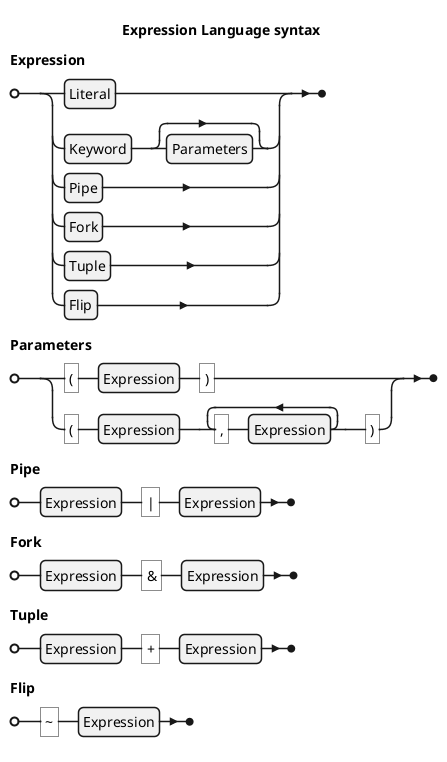

<!-- (c) Copyright 2025 Zenseact AB -->
<!-- SPDX-License-Identifier: Apache-2.0 -->

# ZMBT Expressions

:construction: *This document is in progress* :construction:

ZMBT utilizes an embedded functional programming language for the test data manipulation and matching,
referred to in the documentation simply as *expressions*.

The language resides in the `zmbt::expr` namespace and consists of keywords that can be parametrized and combined into a single expression, resulting in a pure `JSON -> JSON` function, which is evaluated by test model runners. The language belongs to a family of [tacit programming languages](https://en.wikipedia.org/wiki/Tacit_programming).
As it operates on JSON, certain elements may resemble the [jq language](https://jqlang.org/), however, *ZMBT Expressions* focus more on a simpler syntax,
allowing to embed them in any C-like language, and provide certain test-specific features such as typed operator handling.

The main purpose of using an embedded language over common C++ functions is to give the model runners a full control
over test inputs, notably:

- serialization: any complex transformations are represented in JSON
- introspection: model runner can [explain in detail each step of evaluation](#debug-and-trace) without any additional effort from user
- reflection: model runner can preprocess expressions terms to enable high-level parametrization


## Everything is a function

Each expression has the same JSON → JSON evaluation type, which also applies to both built-in and user-defined constants like `Pi` or JSON literals.
For example, `42` represents the function $x \mapsto 42$. This function simply discards its evaluation input instead of yielding an error.
Using a constant or literal as the initial term in composition yields a constant expression.

The *Everything is a function* principle allows different types of expressions to be composed using uniform syntactic rules.
This design makes the expression system monadic in spirit, though not a full monad in the Haskell sense.

!!! note

    The $E = x \mapsto ...$ notation is used below to define functor *expression* E in conventional mathematical notation.
    $E = value$ is a shortcut for a constant expressions, which stands for $E = x \mapsto value$.

## Syntax

General expression syntax is `literal | keyword[(expression...)]`, which expands to following options:

 - `literal`: JSON or any JSON-convertible value (not necessarily an actual C++ literal).
 - `keyword`: builtin expression keyword from zmbt::expr namespace.
 - `keyword(expression...)`: keyword with parameters (*not yet an evaluation call*).

Both `keyword` forms yield a `Expression` object with an `eval` method, used by the framework at runtime,
and `literal` is converted implicitly in corresponding context.

In addition to verbose `keyword(expression...)` notation the Expression API provides syntactic sugar in form
of shortcut infix and prefix operators:

| Shortcut    | Verbose form    | Description               | Example                                              |
| ----------- | --------------- | ------------------------- | ---------------------------------------------------- |
| `A | B | C` | `Pipe(A, B, C)` | Left-to-Right composition | `X | Add(2) | Mul(3)` $= x \mapsto (x + 2) * 3$ |
| `A + B`     | `Tuple(A, B)`   | Quoted constants tuple    | `x + y`               $= x \mapsto [x, y]$      |
| `A & B`     | `Fork(A, B)`    | Evaluation branching      | `x | Add(2) & Mul(3)` $= x \mapsto [x + 2, 3x]$ |
| `~A`        | `Flip(A)`       | Operands swap             | `x | ~Div(1)`         $= x \mapsto 1 / x$, <br> but `x | Div(1)` $= x \mapsto x / 1$|

The expression pipe (`|`) operator is associative from evaluation perspective,
and the chain of multiple infix pipes is unfolded on construction, producing a single variadic `Pipe`:
`A | B | C` yields `Pipe(A, B, C)` rather than `Pipe(Pipe(A, B), C)`.

Infix unfolding is not applied to the fork (`&`) operator, which is non-associative at evaluation.
For this operator the grouping of infix operands is preserved, following
the conventional C operator left-associativity:
`A & B & C` = `(A & B) & C` = `Fork(Fork(A, B), C)`.


### Arity forms

Expression keywords are grouped by their design-time plus evaluation-time parameters arity.

|Form    | Resulting Expression Type                                  |Examples                                        |
|--------|------------------------------------------------------------|------------------------------------------------|
|Const   |$E^C            \mapsto (x \mapsto C)$                      |`Pi`                     $= 3.1415...$|
|Unary   |$E^f            \mapsto (x \mapsto f(x))$                   |`Div` in `Pi | Div(2) | Sin`$= 1$     |
|Binary₁ |$E^*            \mapsto ([x, y] \mapsto x * y )$            |`Add` in `[2,2] | Add`      $= 4$     |
|Binary₂ |$E^*(y)         \mapsto (x \mapsto x * y      )$            |`Eq` in `13 | Eq(42)`       $= false$ |
|Binary₃ |$E^*            \mapsto (x \mapsto x * default)$            |`Max` in `[-1,1] | Max`     $= 1$     |
|Variadic|$E^f(a,b,c,...) \mapsto (x \mapsto f(a,b,c,...)(x))$        |`All` in `6 | All(Gt(5), Le(6))` $= true$|
|Literal₁|Evaluated as Const where a value is expected                |`Map(Eq(0))`   $\not\equiv$ `Map(0)`          |
|Literal₂|Evaluated as `Eq(value)` where a predicate is expected      |`Filter(42)`   $\equiv$ `Filter(Eq(42))`      |

The **Const** keywords are constant functions. They are syntactically equivalent to **Unary**,
with the difference that constants will ignore the eval input value.

Custom constants can be created with `Q` keyword, e.g. `Q(42)` or `Q(Add)`.

JSON or JSON-convertible values produce a **Literal** form which is interpreted as
a constants (**Literal₁**) or a predicate (**Literal₂**) depending on a context.

**Binary** keywords have the most flexible syntax. The canonical **Binary₁** form with no parameters like `Add` expects
a pair of operands at eval input, but **Binary₂** form like `Add(42)` essentially creates a curried unary
functor with bound ***right-hand side*** operand. To curry a left-hand side operand instead, the `Flip` keyword may be helpful.
This is especially useful for non-commutative operators, e.g.:

* `2 | Div(1)` $= 2$
* `2 | Flip(Div(1))` $= 0.5$

For the **Binary₁** the composition with `Reverse` can be utilized instead of `Flip` to get the proper commutation,
as `Flip` only swaps the design-time and evaluation-time arguments, which differs from Haskell's `flip`.

The predicates in **Binary₂** form are very similar to GoogleTest matchers, e.g. `Eq(42)` or `Lt(0.5)`.
It may also be helpful to view this form from an OOP perspective, considering it as
a class method on evaluation-time argument object. E.g.,

```js
input | At(1)
```
is equivalent to
```js
input.At(1)
```
in a generic OOP syntax.


The **Binary₃** form replaces the **Binary₁** behavior for a small group of expressions that have the
default rhs value, e.g. `Max(Id)` is equivalent to just `Max`, where the identity expression `Id`
is a default parameter (a key function in this case).


Evaluation of the unparametrized **Variadic** keywords follow the same rule as **Binary₁** vs **Binary₂**,
e.g. variadic `Fmt`:

* `"%s, %s!" | Fmt("Hello", "world")` $=$ `"Hello, world!"`
* `["%s, %s!", ["Hello", "world"]] | Fmt` $=$ `"Hello, world!"`


## Branching logic and piecewise functions

The Expression API supports several options for branching and piecewise functions:

 - `If` (Lisp-like): `If(cond, then_expr, else_expr)`
 - `If`, `Elif`, `Else` keywords in pipe syntax: `If(cond, expr) | Elif(cond, expr) | Else(expr)`
 - `Lookup` keyword for index- or key-based lookup tables or maps (i.e., arrays, strings, or objects): `Lookup({1,2,3}) | Default(42)`
 - `Default`, `And`, `Or` selection operators


### If-Elif-Else

In both Lisp and pipe formats of `If` statements, the argument is implicitly passed
to lazily-evaluated then/else parameters, so it is possible to produce both constant and computed values:

```
42 | If(42, "X = 42") | Else(~Fmt("X = %d")) -> "X = 42"
13 | If(42, "X = 42") | Else(~Fmt("X = %d")) -> "X = 13"
```

or in Lisp style:

```
42 | If(42, "X = 42", ~Fmt("X = %d")) -> "X = 42"
13 | If(42, "X = 42", ~Fmt("X = %d")) -> "X = 13"
```

For example, to get the same outcome with ternary `And/Or` one needs to capture argument explicitly:

```
"$X" | Eq(42) | And("X = 42") | Or("$X" | ~Fmt("X = %d"))
```

The main difference between two formats is the readability of long elif chains:

```
x   |   If(p1, v1)
    | Elif(p2, v2)
    | Elif(p3, v3)
    | Elif(p4, v4)
    | Else(v5)
```

In Lisp format, each elif case should be placed in nested else expression:

```
x | If(p1, v1, If(p2, v2, If(p3, v3, If(p4, v4, v5))))
```


### Default, And, Or

The `And/Or` argument boolean cast is intended mostly for handling
empty vs non-empty values, so you can write `"" | Or("default")` instead of `"" | If("", "default") | Else(Id)`.

The difference compared to `D` (aka `Default`) is that the latter one emits value only on null and error inputs:

```
"" | Or("foo") -> "foo"
"" | D("foo") -> ""

<error> | Or("foo") -> <error>
<error> | D("foo") -> "foo"

null | Or("foo") -> "foo"
null | D("foo") -> "foo"
```

It is possible to recreate if-else logic with ternary `And/Or` idiom, but very much like in Python or JavaScript,
the `And` parameter cannot hold empty strings, arrays, zero or null:

```
false | And("") | Or("foo") -> "foo"
```

### Lookup

`Lookup` is essentially the reversed counterpart of the query keyword `At` (See `At` and `Flip`).
It is useful for long tables with exact matches by index or key. If no value found, the `Lookup`
will return null, which can be handled with `Default` or `Or` keywords:

```
0 | Lookup({42, 13}) -> 42
1 | Lookup({42, 13}) -> 13
3 | Lookup({42, 13}) -> null
3 | Lookup({42, 13}) | Default(67) -> 67
```

The result of Lookup is not evaluated (and is therefore more performant than an `If/Elif` chain),
but evaluation can be forced with `Eval` keyword:

```
"pi" | Lookup({{"pi", Pi}, {"e", E}}) -> /* unevaluated internal representation */
"pi" | Lookup({{"pi", Pi}, {"e", E}}) | Eval -> 3.141592653589793...
```


## Parameter evaluation

Design-time parameters are constant expressions. A simple use case
is to utilize math constants like `Lt(Pi)`, but any complex expression can be used as long as it is constant,
e. g. `Lt(Pi|Div(2))`.

Parameter evaluation is lazy, s.t. in the ternary and-or idiom `condition | And(then) | Or(else)`
the `else` part is only evaluated if `And(then)` produces falsy output.

In the higher-order expressions parameters are passed unevaluated, similar to quoted expressions.

## Preprocessing

The Expression API provides preprocessing functionality similar to C Preprocessor, s.t.
any string literal starting with $ sign and enclosed in square brackets (e.g. `"$[foo]"`)
is considered a macro. The macro substitution is done on Expression deserialization from
raw JSON data, and user-defined parameter handling is delegated to the test model runners.

## Error handling

Expression evaluation is *pure* and *non-throwing* — errors are represented using the `Err`
expression instead of throwing host-language exceptions.
Terminal expressions, such as arithmetic or logical operators,
do not process Err values but propagate them unchanged through the pipeline.

To handle errors and control branching, expressions such as `Try`, `D` (`Default`), `IsErr`, and `Assert` are available.

## High-order keywords and structural transforms

Several keywords produce higher-order expressions that are useful for creating a more complex matchers or generators.

The most powerful in this group are `Pipe` and `Fork`.
In addition to what is described above, composition also applies a special rule to literals beyond the initial term - they are interpreted as predicates,
e.g. `[1,2,3] | Size | 3` is equivalent to `[1,2,3] | Size | Eq(3)`. To treat literal `3` as a constant expression, quote it as `Q(3)`.


Other useful keywords are:

- `Filter`, `Map`, `Fold` - similar to Python functools, e.g.:
    ```js
    [
       [1, "one"  ],
       [3, "two"  ],
       [2, "three"],
       [4, "four" ],
    ] | Filter(At(1)|Lt(3)) | Map(At(0)) |-> ["one", "two"]
    ```
- `At`, `Transp`, `Slide` - powerful data transformers, e.g.:
    - `Slide(3)|Map(Avg)`: moving average with step width = 3
    - `At("key")`, `At(0)` - simple element getters
    - `At("/foo/bar")` - JSON pointer query
    - `At("::2")` - array slice query
- `Saturate`, `All`, `Any`, `Count` - matcher building elements
- `Recur`, `Unfold` - recursion handlers with exit condition:
    - `Q(Ge(12)) | Recur( 4 & Add(1))` $= 11$
    - `Q(Ge(12)) | Unfold(8 & Add(1))` $= [8,9,10,11]$


For the complete information see [Expression Language Reference](../dsl-reference/expressions.md#higher-order).

## Symbolic linking

:construction: *This feature is in preview state* :construction:

As a step aside from tacit style,
Expressions support two types of symbolic linking using $-prefixed strings as references.


### Argument linking

``` c++
"$x" | Ne(0) | And("$x" | Flip(Div(1))) | Or("$x")
```

In this example, the first encounter of "$x" stores the input value
in an local environment and passes it to the subsequent term,
making it available to all subexpressions, such as `And("$x" | ...)`.
Recall that expression parameter evaluation is lazy.

### Function linking

``` c++
"$f" << ("$x"
   | Assert(Ge(0))
   | Lt(2)
   | And(1)
   | Or("$x" | Sub(1) | "$f" | Mul("$x"))
);
```

This example constructs a recursive factorial function using `<<` as an assignment operator.
The referenced expression is inlined at the call site and evaluated with
the current input. The reference is available to the bound expression itself
and to all its subexpressions, enabling arbitrary recursion.

Each invocation of a function bound with `Fn` establishes a local scope for
argument bindings created via `Link`, forming a lexical closure over the
surrounding bindings. Argument links from outer scopes are captured by the
function and remain accessible unless shadowed by a local binding.
Such captured values can be explicitly read using the `Get` expression


Function bindings are shared across the whole expression and are immutable:
once a reference is bound with `Fn`, it cannot be redefined or reset.

## Quotation

The keyword `Q` (*aliases: C, Const*) serves as a quotation operator, similar to Lisp’s quote.
It lifts its parameter into a constant expression, preventing evaluation.

This allows you to pass expressions as values to `Eval` or `~Bind(...)`,
or to escape the special treatment of $-prefixed strings in parameters:
``` c++
"$x" | Eq(Q("$x"))
```

## Debug and Trace

Consider the following example:

```cpp
auto const f = Debug(Reduce(Add) & Size | Div);
auto const x = L{1,2,3,42.5};
BOOST_CHECK_EQUAL(f.eval(x), 12.125);
```

When log level is set to `DEBUG` or higher, the following evaluation log is printed:

```
2025-07-20T14:04:14.485827201Z DEBUG ZMBT_EXPR_DEBUG
           ┌── Add $ [1,2] = 3
           ├── Add $ [3,3] = 6
           ├── Add $ [6,4.25E1] = 4.85E1
        ┌── Fold(Add) $ [1,2,3,4.25E1] = 4.85E1
        ├── Size $ [1,2,3,4.25E1] = 4
     ┌── Fold(Add) & Size $ [1,2,3,4.25E1] = [4.85E1,4]
     ├── Div $ [4.85E1,4] = 1.2125E1
  □  (Fold(Add) & Size) | Div $ [1,2,3,4.25E1] = 1.2125E1
```

Log lines are formatted as `f $ x = result`, and connected with line-drawing to show the expression terms hierarchy.

In model tests, the evaluation is logged on failing tests by default.

Another debugging utility keyword is `Trace`, which works like `Id` but also prints it's parameter to the call.
It can be combined with `ZMBT_CUR_LOC` macro to trace mock invocations:

```c++
auto const f = Trace(ZMBT_CUR_LOC) | Reduce(Add) & Size | Div;
auto const x = L{1,2,3,42.5};
```

outputs

```
zmbt-framework/backends/cxx/test/expr_api.cpp#1010 [1,2,3,4.25E1]
```

to the log.


The `Debug` keyword respects nesting - you can use it on different levels on the same expression,
possibly chaining with `Trace` to distinguish subexpressions, e.g.

```c++
40 | Debug(Trace("foo") | Add(2) | Debug(Trace("bar") | Sub(2)))
```

produces

```
2025-07-21T20:55:32.037990154Z DEBUG ZMBT_EXPR_DEBUG
     ┌── Trace("bar") $ 42 = 42
     ├── Sub(2) $ 42 = 40
  □  Trace("bar") | Sub(2) $ 42 = 40

2025-07-21T20:55:32.038143599Z DEBUG ZMBT_EXPR_DEBUG
     ┌── Trace("foo") $ 40 = 40
     ├── Add(2) $ 40 = 42
     │      ┌── Trace("bar") $ 42 = 42
     │      ├── Sub(2) $ 42 = 40
     │   ┌── Trace("bar") | Sub(2) $ 42 = 40
     ├── Dbg(Trace("bar") | Sub(2)) $ 42 = 40
  □  Trace("foo") | Add(2) | Dbg(Trace("bar") | Sub(2)) $ 40 = 40
```

### Line trimming

For the bulky log messages, elements are trimmed with `...` while trying to keep the evaluation result visible.
This option can be disabled with `--zmbt_log_notrim` flag.

## Grammar


