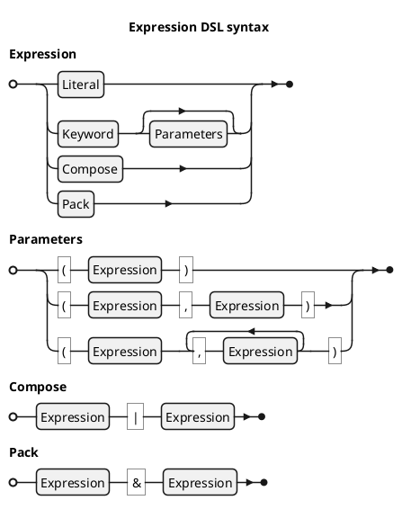

<!-- (c) Copyright 2025 Zenseact AB -->
<!-- SPDX-License-Identifier: Apache-2.0 -->

# ZMBT Expressions

:construction: *This document is in progress* :construction:

ZMBT utilizes an embedded functional programming language for the test data manipulation and matching,
referred in the documentation simply as *expressions*.

The language resides in the `zmbt::expr` namespace and consists of keywords that can be parametrized and combined into a single expression, resulting in a pure function of type `JSON -> JSON`, which is evaluated by test model runners. The language belongs to a family of [tacit programming languages](https://en.wikipedia.org/wiki/Tacit_programming). As it operates on JSON, certain elements may resemble the
[jq language](https://jqlang.org/), however, *expressions* focus more on a simpler syntax
and certain test-specific features like typed operator handling.


## Syntax

Expression keywords are grouped by their resulting arity, counting both design-time and evaluation-time parameters.

General syntax: `Keyword` or `#!ts Keyword(<Expression list>...)`, where the second form is a design-time parametrization, but not yet an evaluation.
Both forms yield a `Expression` object with an `eval` method, used by the framework at runtime.

The `*` operator is syntactic sugar for `eval`, and is used in examples below for brevity.


|Form    | Resulting Expression Type                                  |Example                            |
|--------|-------------------------------------------------------     |---------------------------------- |
|Const   |$E^C            \mapsto (x \mapsto C)$                      |`#!js Pi * null = 3.1415...       `|
|Unary   |$E^f            \mapsto (x \mapsto f(x))$                   |`#!js Sin *` $\frac{\pi}{2}$ `= 1 `|
|Binary₁ |$E^*            \mapsto ([x, y] \mapsto x * y )$            |`#!js Add * [2,2] = 4             `|
|Binary₂ |$E^*(y)         \mapsto (x \mapsto x * y      )$            |`#!js Eq(42) * 13 = ⊥             `|
|Binary₃ |$E^*            \mapsto (x \mapsto x * default)$            |`#!js Max * [-1,1] = 1            `|
|Ternary |$E^f(a, b)      \mapsto (x \mapsto f(a, b)(x))$             |`#!js Recur(Pow(2), 4) * 4 = 65536`|
|Variadic|$E^f(a,b,c,...) \mapsto (x \mapsto f(a,b,c,...)(x))$        |`#!js All(Gt(5), Le(6)) * 6 = ⊤   `|
|Literal₁|Evaluated as Const where a value is expected                |`#!js Map(Eq(0)) ≢ Map(0)         `|
|Literal₂|Evaluated as `#!ts Eq(value)` where a predicate is expected |`#!js Filter(42) ≡ Filter(Eq(42)) `|

The **Const** keywords creates constant functions. They are syntactically equivalent to **Unary**,
with the difference that constants will ignore the eval input value.

Custom constants can be created with `C` or `Let` keyworda, e.g. `C(42)`.
JSON or JSON-convertible literals also create constants, except in a predicate context - then it yields equality check `Eq(x)`.

**Binary** keywords have the most flexible syntax. The canonic **Binary₁** form with no parameters like `Add` expects
a pair of operands at eval input, but **Binary₂** form like `Add(42)` essentially creates a curried unary
functor with bound ***right-hand side*** operand. To curry a left-hand side operand instead, the `Flip` keyword may be helpful.
This is especially useful for non-commutative operators, e.g.:

```js
Div(1) * 2 = 2
Flip(Div(1)) * 2 = 0.5
```

For the **Binary₁** the composition with `Reverse` can be utilized instead of `Flip` to get the proper commutation,
as `Flip` only swaps the design-time and eval-time arguments, which differs it from Huskell flip.

The predicates in **Binary₂** form are very similar to GoogleTest matchers, e.g. `#!ts Eq(42)` or `#!ts Lt(0.5)`.
It may be also helpful for understanding to look this form from OOP perspective, considering it as
a class method on eval-time argument object. E.g.,
```js
At(1) * ["foo", 42]
```
is equivalent to
```js
["foo", 42].At(1)
```
in a generic OOP syntax.


The **Binary₃** form replaces the **Binary₁** behavior for a small group of expressions that have the
default rhs value, e.g. `#!ts Max(Id)` is equivalent to just `Max`, where the identity expression `Id`
is a default parameter (a key function in this case).


The **Ternary** and **Variadic** keywords, with a few exceptions,
follows the same evaluation rule as **Binary1** vs **Binary₂** for cases with no design-time parameters, e.g. variadic

```js
Format("Hello", "world") * "%s, %s!"
Format * ["%s, %s!", ["Hello", "world"]]
```
are both valid and produce the same result.


## High-order keywords and structural transforms

Several keywords produce high-order expressions that are useful for creating a complex matchers or generators.

The most powerful in this group are `Compose` and `Pack`, which also can be expressed with
overloaded infix operators for brevity (listed in precedence order from highest to lowest):

|Operator|keyword                                      | Description                             |
|----    |----                                         |-----------                              |
|\|      |[Compose](/dsl-reference/expressions#compose)| compose expressions                     |
|&       |[Pack](/dsl-reference/expressions#pack)      | evaluate and pack results into an array |


With the pipe operator, the actual C++ syntax is even closer to generic OOP syntax:
```c++
"%s, %s!"|Format("Hello", "world")
```

Composition also has a special rule for literals beyond the initial term - they are interpreted as predicates,
e.g.
```c++
[1,2,3]|Size|3
```
is equivalent to
```c++
[1,2,3]|Size|Eq(3)
```

Other useful keywords are:

- `Filter`, `Map`, `Reduce` - similar to Python functools, e.g.:
      ```js
      Filter(At(1)|Lt(3)) | Map(At(0)) * \
         [
            [1, "one"  ],
            [3, "two"  ],
            [2, "three"],
            [4, "four" ],
         ] == ["one", "two"]
      ```
- `At`, `Transp`, `Slide` - powerfool data transformers, e.g.:
      - `Slide(3)|Map(Avg)`: moving average with step width = 3
      - `At("key")`, `At(0)` - simple element getters
      - `At("/foo/bar")` - JSON pointer query
      - `At("::2")` - array slice query
- `Saturate`, `All`, `Any`, `Count` - matcher building elements


For the complete information see [Expression DSL reference](\ref expression-dsl-reference-high-order).


## Parameter evaluation

Design time parameters can be specified with constant expressions. By the fact,
`Lt(42)` is a syntactic sugar for `Lt(C(42))`. A simple use case
is to utilize math constants like `Lt(Pi)`, but any complex expression can be used as long as it is constant,
e. g. `Lt(Pi|Div(2))`.

The only context where design parameters are not evaluated are high-order expressions - any callable parameter
is taken as is.

## Debug

Complex expressions evaluation

```cpp
Expression::EvalContext ctx{};
ctx.log = Expression::EvalLog::make();

auto const f = Reduce(Add) & Size | Div;
auto const x = L{1,2,3,42.5};
f.eval(x, ctx);
std::cerr << ctx.log << '\n';
```

Produced output is printed bottom-up in order of evaluation:
```
         ┌── ":add"([1,2]) = 3
         ├── ":add"([3,3]) = 6
         ├── ":add"([6,4.25E1]) = 4.85E1
      ┌── {":reduce":":add"}([1,2,3,4.25E1]) = 4.85E1
      ├── ":size"([1,2,3,4.25E1]) = 4
   ┌── {":pack":[{":reduce":":add"},":size"]}([1,2,3,4.25E1]) = [4.85E1,4]
   ├── ":div"([4.85E1,4]) = 1.2125E1
□  {":compose":[":div",{":pack":[{":reduce":":add"},":size"]}]}([1,2,3,4.25E1]) = 1.2125E1
```
Log lines are formatted as `#!ts f(x) = result`, and connected with line-drawing to show the expression terms hierarchy.

In model tests, the evaluation stack is logged on failing tests.
For the bulky log messages the elements are trimmed with `...` while trying to keep evaluation result visible:
``` json
{":compose":[":div",{":pack":[{":reduce":":add"},":size"]}]}([1,2,3,...) = 5
```
For the complete log data refer to JSON log.

## Grammar



